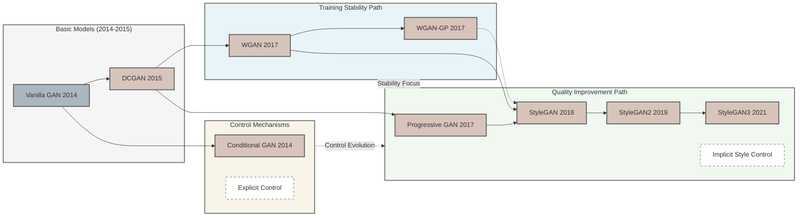

# GANs Research Reproduction



This repository contains implementations of key Generative Adversarial Network (GAN) architectures, organized in an incremental learning approach.


## Implementation Progress

1. **Basic GANs**
   - [x] **Vanilla GAN**: Original formulation with fully connected layers for both generator and discriminator networks.
   - [ ] **DCGAN**: Introduced convolutional architectures and established key architectural guidelines for stable GAN training.
   
2. **Training Stability Improvements**
   - [ ] **WGAN**: Improved training stability using Wasserstein distance.
   - [ ] **WGAN-GP**: Enhanced WGAN with gradient penalty.
   
3. **Conditional Control**
   - [ ] **Conditional GAN**: Added ability to control generation with explicit labels.
   
4. **High-Quality Generation**
   - [ ] **Progressive GAN**: Introduced progressive growing methodology for generating high-resolution images.
   - [ ] **StyleGAN v1**: Combined progressive growing with style-based generation.
   - [ ] **StyleGAN v2**: Improved architecture and removing progressive growing.
   - [ ] **StyleGAN v3**: Added alias-free generation techniques.


## Installation

```bash
pip install -r requirements.txt
```


## Usage

Each GAN implementation has its own training script in the `experiments` directory:

```bash
# Example: Train a basic GAN on MNIST
python experiments/stage1_basic/train_vanilla_gan.py
```


## Project Structure

- `models/`: GAN implementations
- `data/`: Dataset loading and processing
- `training/`: Training utilities and loss functions
- `evaluation/`: Evaluation metrics and visualization tools
- `utils/`: Helper utilities
- `experiments/`: Training scripts for each GAN variant
- `configs/`: Configuration files


## References

- [Generative Adversarial Networks (2014)](https://arxiv.org/abs/1406.2661)
- [DCGAN (2015)](https://arxiv.org/abs/1511.06434)
- [Wasserstein GAN (2017)](https://arxiv.org/abs/1701.07875)
- [WGAN-GP (2017)](https://arxiv.org/abs/1704.00028)
- [Conditional GANs (2014)](https://arxiv.org/abs/1411.1784)
- [Progressive GAN (2017)](https://arxiv.org/abs/1710.10196)
- [StyleGAN (2018)](https://arxiv.org/abs/1812.04948)
- [StyleGAN2 (2019)](https://arxiv.org/abs/1912.04958)
- [StyleGAN3 (2021)](https://arxiv.org/abs/2106.12423)