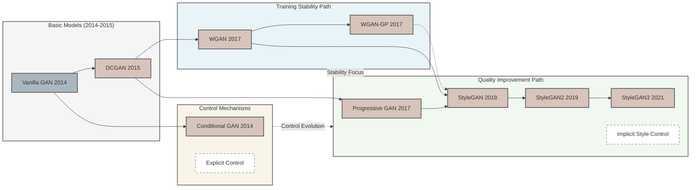

# GANs Research Reproduction from Scratch

<div align="center">
  
</div>



This repository contains implementations of key Generative Adversarial Network (GAN) architectures, organized in an incremental learning approach.


## Implementation Progress

1. **Basic GANs**
   - [x] **Vanilla GAN**: Original formulation with fully connected layers for both generator and discriminator networks.
   - [x] **DCGAN**: Introduced convolutional architectures and established key architectural guidelines for stable GAN training.
   
2. **Training Stability Improvements**
   - [x] **WGAN**: Improved training stability using Wasserstein distance.
   - [x] **WGAN-GP**: Enhanced WGAN with gradient penalty.
   
3. **Conditional Control**
   - [x] **Conditional GAN**: Added ability to control generation with explicit labels.
   
4. **High-Quality Generation**
   - [ ] **Progressive GAN**: Introduced progressive growing methodology for generating high-resolution images.
   - [ ] **StyleGAN v1**: Combined progressive growing with style-based generation.
   - [ ] **StyleGAN v2**: Improved architecture and removing progressive growing.
   - [ ] **StyleGAN v3**: Added alias-free generation techniques.


## Installation

### Option 1: Install dependencies only
```bash
pip install -r requirements.txt
```

### Option 2: Install as a package (recommended for development)
```bash
# If you have a previous installation, remove it first
pip uninstall gans-research

# Install in editable mode
pip install -e .
```


## Usage

### Training
Each GAN implementation has its own training script in the `experiments` directory:

```bash
# Example: Train a basic GAN on MNIST
python experiments/stage1_basic/train_vanilla_gan.py
```

### Evaluation
Evaluation scripts are located in the `experiments` directory:

```bash
# Evaluate a trained model
python experiments/evaluate.py --config configs/vanilla_gan.yaml

# Evaluate specific metrics
python experiments/evaluate.py --config configs/vanilla_gan.yaml --metrics quality
python experiments/evaluate.py --config configs/vanilla_gan.yaml --metrics coverage
python experiments/evaluate.py --config configs/vanilla_gan.yaml --metrics speed

# Customize evaluation parameters
python experiments/evaluate.py --config configs/vanilla_gan.yaml --num_samples 5000 --batch_size 32
```

**Configuration Example**

Evaluation configuration is part of the model's config YAML file:

```yaml
evaluation:
  batch_size: 64
  num_samples: 10000
```

### Inference

#### Unconditional Generation

Example: generate images using a trained Vanilla GAN model on MINIST:

```
python experiments/inference.py --config configs/vanilla_gan.yaml
```


#### Conditional Generation

Example: generate images using a trained Conditional GAN model on MINIST:

- generate multiple images for each label:

```python
python experiments/inference.py --config configs/cgan.yaml --labels 0,1,2,3,4,5,6,7,8,9 --num_samples 5
```

- generate one image for each label:

```
python experiments/inference.py --config configs/cgan.yaml --labels 2,5
```

**Configuration Example**

YAML config should include the following fields:

```yaml
inference:  # or dcgan, wgan, etc.
  checkpoint_path: outputs/vanilla_gan/checkpoints/final_model.pth
  num_samples: 16
model:
  name: vanilla_gan
experiment:
  output_dir: outputs/vanilla_gan
```


## Project Structure

The project is organized as follows:

```
gans-research/
├── configs/                 # Configuration files for each GAN variant
├── data/                    # Dataset loading and processing utilities
├── evaluation/              # Evaluation metrics and visualization tools
│   ├── metrics/             # Implementation of evaluation metrics (FID, etc.)
│   └── visualization/       # Visualization utilities for generated images
├── experiments/             # Training and evaluation scripts
│   └── stage1_basic/        # Training scripts for basic GAN models
├── src/                     # Core source code
│   ├── data/                # Dataset handling
│   ├── losses/              # Loss functions for different GAN variants
│   ├── metrics/             # Evaluation metrics (FID, precision-recall)
│   ├── models/              # Model implementations
│   │   ├── base/                # Base classes for generators and discriminators
│   │   ├── vanilla_gan/         # Vanilla GAN implementation
│   │   ├── dcgan/               # Deep Convolutional GAN implementation
│   │   ├── cgan/                # Conditional GAN implementation
│   │   ├── wgan/                # Wasserstein GAN implementation
│   │   ├── wgan_gp/             # Wasserstein GAN with Gradient Penalty implementation
│   │   ├── prog_gan/            # Progressive GAN implementation
│   │   ├── stylegan1/           # StyleGAN v1 implementation
│   │   ├── stylegan2/           # StyleGAN v2 implementation
│   │   └── stylegan3/           # StyleGAN v3 implementation
│   ├── training/            # Training utilities
│   └── utils/               # Helper utilities
└── pyproject.toml           # Package configuration
```


## References

- [Generative Adversarial Networks (2014)](https://arxiv.org/abs/1406.2661)
- [DCGAN (2015)](https://arxiv.org/abs/1511.06434)
- [Wasserstein GAN (2017)](https://arxiv.org/abs/1701.07875)
- [WGAN-GP (2017)](https://arxiv.org/abs/1704.00028)
- [Conditional GANs (2014)](https://arxiv.org/abs/1411.1784)
- [Progressive GAN (2017)](https://arxiv.org/abs/1710.10196)
- [StyleGAN (2018)](https://arxiv.org/abs/1812.04948)
- [StyleGAN2 (2019)](https://arxiv.org/abs/1912.04958)
- [StyleGAN3 (2021)](https://arxiv.org/abs/2106.12423)
